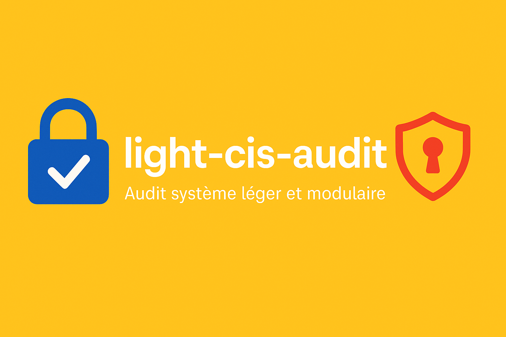

# 🔒 light-cis-audit

**light-cis-audit** est un outil d’audit système **léger**, **modulaire** et **auto-hébergeable**, conçu pour vérifier rapidement la sécurité de la configuration des serveurs Linux (Debian/RedHat), en s’inspirant des recommandations CIS ([Center for Internet Security](https://www.cisecurity.org/)) sans la lourdeur des outils traditionnels.

---
## 🎯 Objectifs

- ✅ Vérifier les configurations critiques (SSH, utilisateurs, firewall, permissions…)
- 📋 Générer des rapports clairs et lisibles (Markdown, JSON, HTML à venir)
- 🧩 Fournir une architecture simple pour écrire et maintenir ses propres checks
- 🚫 Zéro dépendance lourde, pas de modification du système (read-only)

---

## 🛠️ Fonctionnalités

- 🔐 Vérification de la configuration SSH (port, root login, protocol, etc.)
- 👥 Détection des comptes sans mot de passe
- 🔥 État du pare-feu (UFW, iptables)
- 🧱 Analyse des fichiers à permissions spéciales (SUID)
- 🧪 Résultats catégorisés : `PASS`, `FAIL`, `WARN`, `INFO`
- 🖥️ Interface en ligne de commande minimaliste

---


## 🖥️ Prérequis système
Avant d’installer et d’utiliser light-cis-audit, assurez-vous que les outils suivants sont disponibles sur votre système :

### Debian / Ubuntu

```bash
sudo apt update
sudo apt install -y git python3 python3-venv python3-pip
```

### RedHat / CentOS / AlmaLinux / Fedora / RockyLinux

```bash
sudo dnf install -y git python3 python3-venv python3-pip
```
> Sur les anciennes versions, utilisez `yum` à la place de `dnf` si nécessaire.

## 🚀 Installation

```bash
git clone https://github.com/medaey/light-cis-audit.git
cd light-cis-audit
chmod +x run-audit.sh
```

Le script `run-audit.sh` se charge de créer et activer l’environnement virtuel, installer les dépendances et lancer l’audit.

---

## ⚡ Usage

### Lancer l’audit via le script shell (recommandé)

```bash
sudo ./run-audit.sh [options]
```

**Exemples :**

- Lancer tous les checks et afficher le rapport JSON dans la console (par défaut)  
  ```bash
  sudo ./run-audit.sh
  ```

- Lancer tous les checks et sauvegarder le rapport en Markdown dans un fichier  
  ```bash
  sudo ./run-audit.sh --output markdown --output-file rapport.md
  ```

- Lancer des checks ciblés (exemple : SSH, utilisateurs et permissions)
  ```bash
  sudo ./run-audit.sh --check ssh users permissions
  ```

- Afficher l’aide
  ```bash
  ./run-audit.sh --help
  ```

---

### Lancer l’audit directement avec Python (optionnel)

Si tu préfères gérer manuellement l’environnement Python :

```bash
python3 -m venv venv
source venv/bin/activate
pip install -r requirements.txt
sudo python3 main.py [options]
```

Les options disponibles sont les mêmes que pour le script `run-audit.sh`.

---

### Afficher l’aide

```bash
python3 main.py --help
```

---

## 📊 Exemple de sortie JSON

```json
[
  {
    "id": "SSH-001",
    "description": "SSH root login must be disabled",
    "result": "PASS",
    "details": "PermitRootLogin is set to no"
  },
  {
    "id": "USER-002",
    "description": "No user account without password",
    "result": "FAIL",
    "details": "User 'backup' has no password set"
  }
]
```

---

## 📁 Arborescence

```bash
light-cis-audit/
├── audit/           # Modules pour chaque domaine (ssh, users, etc.)
├── images/          # Dossier regroupant toutes les ressources graphiques (bannières, icônes, captures d'écran)
├── reports/         # Générateurs de rapports (json, markdown...)
├── tests/           # Tests unitaires
├── main.py          # CLI principale
├── requirements.txt
├── run-audit.sh     # Script shell pour lancer l’audit facilement
└── README.md
```

---

## ✅ Roadmap

- [ ] Option --fix pour corriger automatiquement certains problèmes
- [ ] Rapport HTML interactif
- [ ] Profils personnalisables (cis, minimal, custom)

---

## 🤝 Contribution

Les contributions sont les bienvenues !  
Suggestions, issues et pull requests sont ouvertes à tous.

---

## 🛡️ Disclaimer

Ce projet est fourni à des fins **d’audit rapide.**  
Il **ne remplace pas un audit complet** réalisé par un professionnel de la sécurité.

---

## 👤 Auteur

Projet développé par @medaey